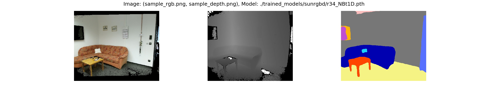
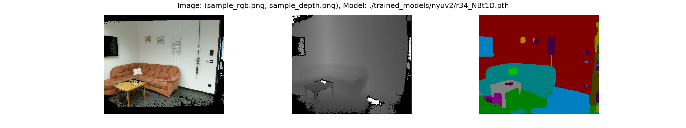

# Semantic Segmentation for Indoor Scene Analysis

The code in this repository is mostly taken from 2021 state of the art ESA-Net.
Paper: [IEEE Xplore](https://ieeexplore.ieee.org/document/9561675),  [arXiv](https://arxiv.org/pdf/2011.06961.pdf).
Repository: [Github](https://github.com/TUI-NICR/ESANet.git)

This repository contains the code of 
Training on RGB only, Depth only and RGBD for both Real and Synthetic Datasets.
Validation of Real on Real, Real on Synthetic, Synthetic on Synthetic, Synthetic on Real.

## Setup

1. Clone repository:
    ```bash
    git clone git@github.com:hussainhadi673/Semantic-Segmentation.git
   
    cd /path/to/this/repository
    ```

2. Set up anaconda environment including all dependencies:
    ```bash
    # create conda environment from YAML file
    conda env create -f rgbd_segmentation.yaml
    # activate environment
    conda activate rgbd_segmentation
    ```

3. Data preparation (training / evaluation / dataset inference):  
    We trained our networks on 
    [NYUv2](https://cs.nyu.edu/~silberman/datasets/nyu_depth_v2.html), 
    [SceneNet RGB-D](https://robotvault.bitbucket.io/scenenet-rgbd.html). 

    The folder [`src/datasets`](src/datasets) contains the code to prepare
    NYUv2, SunRGB-D, Cityscapes, SceneNet RGB-D for training and evaluation. 
    Please follow the instructions given for the respective dataset and store 
    the created datasets in `./datasets`.

4. Pretrained models (evaluation):  
   We provide the weights for our selected ESANet on NYUv2 and Scenenet RGBD:
   
   | Dataset                       | Modality         |Classes| mIoU  | URL  |
   |-------------------------------|------------------|-------|-------|------|
   | NYUv2 (test)                  | RGBD             |  40   | 47.92 | [Download](https://drive.google.com/file/d/1-ZpOQEbuqeEuBpoOCQ8StP2iUxPQ2wKo/view?usp=share_link) |
   |    	         	   | RGB Only	      |	 40   | 40.42 | [Download](https://drive.google.com/file/d/1-CQlRMhTbTgdIGEFQb8sKwcbmz2urnfi/view?usp=share_link) |
   | 		                   | Depth Only       |  40   | 37.21 | [Download](https://drive.google.com/file/d/1-QymKrTfohhK-jaWN_i80SKY3OkUZZfZ/view?usp=share_link) |
   | 		                   | RGBD             |  13   | 63.18 | [Download](https://drive.google.com/file/d/10DFvJmJ6B9Cq1UdOGAZYG-kEkbVWWxSh/view?usp=share_link) |                                       |
   | SceneNet-RGBD (test)          | RGBD	      |  13   | 46.7  | [Download](https://drive.google.com/file/d/1-vk5KxMv3lhguqxTZktGlV3L9PGWgg1d/view?usp=share_link) |


   Download and extract the models to `./trained_models`.

5. Cross Validation Results:

   | Dataset                       | Modality         |Classes| mIoU  | 
   |-------------------------------|------------------|-------|-------|
   | NYUv2 - ScenetNet RGBD        | RGBD             |  13   | 16.82 | 
   |    	         	   | RGBD	      |	 40   | 20.77 | 
   | NYUv2 - SUN-RGBD		   | RGBD             |  40   | 24.83 | 
   | SceneNet-RGBD - NYUv2         | RGBD             |  13   | 19.92 |  

## Content
There are subsection for different things to do:
- [Evaluation](#evaluation): Reproduce results reported in our paper.
- [Dataset Inference](#dataset-inference): Apply trained model to samples from dataset.
- [Sample Inference](#sample-inference): Apply trained model to samples in [`./samples`](samples).
- [Time Inference](#time-inference): Time inference on NVIDIA Jetson AGX Xavier using TensorRT.
- [Training](#training): Train new ESANet model.

## Evaluation
To reproduce the mIoUs reported in our paper, use `eval.py`.

> Note that building the model correctly depends on the respective dataset the 
model was trained on. Passing no additional model arguments to `eval.py` 
defaults to evaluating our ESANet-R34-NBt1D either on NYUv2 or SUNRGB-D. 
For Cityscapes the parameters differ. You will find a `argsv_*.txt` file next 
to the network weights listing the required arguments.

Examples: 
- To evaluate our ESANet-R34-NBt1D trained on NYUv2, run:
    ```bash
    python eval.py \
        --dataset nyuv2 \
        --dataset_dir ./datasets/nyuv2 \
        --ckpt_path ./trained_models/nyuv2/r34_NBt1D.pth
     
    # Camera: kv1 mIoU: 50.30
    # All Cameras, mIoU: 50.30
    ```
- To evaluate our ESANet-R34-NBt1D trained on SUNRGB-D, run:
    ```bash
    python eval.py \
        --dataset sunrgbd \
        --dataset_dir ./datasets/sunrgbd \
        --ckpt_path ./trained_models/sunrgbd/r34_NBt1D.pth
    
    # Camera: realsense mIoU: 32.42
    # Camera: kv2 mIoU: 46.28
    # Camera: kv1 mIoU: 53.39
    # Camera: xtion mIoU: 41.93
    # All Cameras, mIoU: 48.17
    ```
  
- To evaluate our ESANet-R34-NBt1D trained on Cityscapes, run:
    ```bash
    # half resolution (1024x512)
    python eval.py \
        --dataset cityscapes-with-depth \
        --dataset_dir ./datasets/cityscapes \
        --ckpt_path ./trained_models/cityscapes/r34_NBt1D_half.pth \
        --height 512 \
        --width 1024 \
        --raw_depth \
        --context_module appm-1-2-4-8
   
    # Camera: camera1 mIoU: 75.22
    # All Cameras, mIoU: 75.22  
  
  
    # full resolution (2048x1024)
    # note that the model is created and was trained on half resolution, only
    # the evalution is done using full resolution  
    python eval.py \
        --dataset cityscapes-with-depth \
        --dataset_dir ./datasets/cityscapes \
        --ckpt_path ./trained_models/cityscapes/r34_NBt1D_full.pth \
        --height 512 \
        --width 1024 \
        --raw_depth \
        --context_module appm-1-2-4-8 \
        --valid_full_res
  
    # Camera: camera1 mIoU: 80.09
    # All Cameras, mIoU: 80.09
    ```


## Inference
We provide scripts for inference on both sample input images 
(`inference_samples.py`) and samples drawn from one of our used datasets 
(`inference_dataset.py`). 

> Note that building the model correctly depends on the respective dataset the 
model was trained on. Passing no additional model arguments to `eval.py` 
defaults to evaluating our ESANet-R34-NBt1D either on NYUv2 or SUNRGB-D. 
For Cityscapes the parameters differ. You will find a `argsv_*.txt` file next 
to the network weights listing the required arguments for Cityscapes. 

### Dataset Inference
Use `inference_dataset.py` to apply a trained model to samples drawn from one of 
our used datasets:

Example: To apply ESANet-R34-NBt1D trained on SUNRGB-D to samples from SUNRGB-D, 
run:
```bash
# note that the entire first batch is visualized, so larger batch sizes results 
# in smaller images in the plot
python inference_dataset.py \
    --dataset sunrgbd \
    --dataset_dir ./datasets/sunrgbd \
    --ckpt_path ./trained_models/sunrgbd/r34_NBt1D_scenenet.pth \
    --batch_size 4
```

### Sample Inference
Use `inference_samples.py` to apply a trained model to the samples given in 
`./samples`.

> Note that the dataset argument is required to determine the correct 
preprocessing and the class colors. However, you do not need to prepare the 
respective dataset. Furthermore, depending on the given depth images and the 
used dataset for training, an additional depth scaling might be necessary.

Examples: 
- To apply our ESANet-R34-NBt1D trained on SUNRGB-D to the samples, run:
    ```bash
    python inference_samples.py \
        --dataset sunrgbd \
        --ckpt_path ./trained_models/sunrgbd/r34_NBt1D.pth \
        --depth_scale 1 \
        --raw_depth
    ```
    
  
- To apply our ESANet-R34-NBt1D trained on NYUv2 to the samples, run:
    ```bash
    python inference_samples.py \
        --dataset nyuv2 \
        --ckpt_path ./trained_models/nyuv2/r34_NBt1D.pth \
        --depth_scale 0.1 \
        --raw_depth
    ```
    

### Time Inference
We timed the inference on a NVIDIA Jetson AGX Xavier with Jetpack 4.4 
(TensorRT 7.1.3, PyTorch 1.4.0).

Reproducing the timings on a NVIDIA Jetson AGX Xavier with Jetpack 4.4 further 
requires:
- [the PyTorch 1.4.0 wheel](https://nvidia.box.com/shared/static/ncgzus5o23uck9i5oth2n8n06k340l6k.whl) from [NVIDIA Forum](https://forums.developer.nvidia.com/t/pytorch-for-jetson-version-1-7-0-now-available/72048)
- [the NVIDIA TensorRT Open Source Software](https://github.com/NVIDIA/TensorRT/releases/tag/7.1.3) (`onnx2trt` is used to convert the onnx model to a TensorRT engine) 
- the requirements listed in `requirements_jetson.txt`:
    ```bash
    pip3 install -r requirements_jetson.txt --user
    ```

Subsequently, you can run `inference_time.sh` to reproduce the reported timings 
for ESANet.

The inference time of a single model can be computed with 
`inference_time_whole_model.py`.

Example: To reproduce the timings of our ESANet-R34-NBt1D trained on NYUv2, run:
```bash
python3 inference_time_whole_model.py \
    --dataset nyuv2 \
    --no_time_pytorch \
    --no_time_onnxruntime \
    --trt_floatx 16
``` 
> Note that a Jetpack version earlier than 4.4 fails completely or results in 
deviating outputs due to differently handled upsampling.

To reproduce the timings of other models we compared in our paper to, follow the 
instructions given in [src/models/external_code](src/models/external_code).

### Training
Use `train.py` to train ESANet on NYUv2, SUNRGB-D, Cityscapes, or SceneNet RGB-D
(or implement your own dataset by following the implementation of the provided 
datasets).
The arguments default to training ESANet-R34-NBt1D on NYUv2 with the 
hyper-parameters from our paper. Thus, they could be omitted but are presented 
here for clarity.

> Note that training ESANet-R34-NBt1D requires the pretrained weights for the 
encoder backbone ResNet-34 NBt1D. You can download our pretrained weights on 
ImageNet from [Link](https://drive.google.com/uc?id=1neUb6SJ87dIY1VvrSGxurVBQlH8Pd_Bi). 
Otherwise, you can use `imagenet_pretraining.py` to create your own pretrained weights.

Examples: 
- Train our ESANet-R34-NBt1D on NYUv2 (except for the dataset arguments, also 
valid for SUNRGB-D):
    ```bash
    # either specify all arguments yourself
    python train.py \
        --dataset nyuv2 \
        --dataset_dir ./datasets/nyuv2 \
        --pretrained_dir ./trained_models/imagenet \
        --results_dir ./results \
        --height 480 \
        --width 640 \
        --batch_size 8 \
        --batch_size_valid 24 \
        --lr 0.01 \
        --optimizer SGD \
        --class_weighting median_frequency \
        --encoder resnet34 \
        --encoder_block NonBottleneck1D \
        --nr_decoder_blocks 3 \
        --modality rgbd \
        --encoder_decoder_fusion add \
        --context_module ppm \
        --decoder_channels_mode decreasing \
        --fuse_depth_in_rgb_encoder SE-add \
        --upsampling learned-3x3-zeropad
    
    # or use the default arguments
    python train.py \
        --dataset nyuv2 \
        --dataset_dir ./datasets/nyuv2 \
        --pretrained_dir ./trained_models/imagenet \
        --results_dir ./results
    ```

- Train our ESANet-R34-NBt1D on Cityscapes:
    ```bash
    # note that the some parameters are different
    python train.py \
        --dataset cityscapes-with-depth \
        --dataset_dir ./datasets/cityscapes \
        --pretrained_dir ./trained_models/imagenet \
        --results_dir ./results \
        --raw_depth \
        --he_init \
        --aug_scale_min 0.5 \
        --aug_scale_max 2.0 \
        --valid_full_res \
        --height 512 \
        --width 1024 \
        --batch_size 8 \
        --batch_size_valid 16 \
        --lr 1e-4 \
        --optimizer Adam \
        --class_weighting None \
        --encoder resnet34 \
        --encoder_block NonBottleneck1D \
        --nr_decoder_blocks 3 \
        --modality rgbd \
        --encoder_decoder_fusion add \
        --context_module appm-1-2-4-8 \
        --decoder_channels_mode decreasing \
        --fuse_depth_in_rgb_encoder SE-add \
        --upsampling learned-3x3-zeropad
    ```

For further information, use `python train.py --help` or take a look at 
`src/args.py`.

> To analyze the model structure, use `model_to_onnx.py` with the same 
arguments to export an ONNX model file, which can be nicely visualized using 
[Netron](https://github.com/lutzroeder/netron).
